Meltdown and Spectre .. for normal people
==========================================

_Meltdown_ and _Spectre_ are security flaws that gained widespread media coverage in the first days of 2018. Contrary to other security bugs these flaws are

- hardware, not software based
- the direct consequence of years of performance improvements
- extremely widespread because they affect (nearly all) computer systems, including mobile phones

Most coverages of these flaws fall either into the category "Intel caused a terrible security bug. And now the weather." (AKA _we are going to die!_)  or "By priming the BPU of the CPU a malicious process can read out of bounds memory via speculative code execution" (AKA _white noise_ to most people).

## How this is different

This is for "normal people". With these slides I fill the hole between _we are going to die!_ and _white noise_. You, the reader, will understand _what_ went wrong,  _how_ it went wrong, and _why_ this is bad. I will try to minimise the computer specialists words to an absolute minimum. Promised!

## Preview

Here are some slides from the presentation ([keynote](slides/Neuhalfen_Meltdown_Spectre_for_normal_people.key), [PDF](Neuhalfen_Meltdown_Spectre_for_normal_people.pdf), [html](html_export/Neuhalfen_Meltdown_Spectre_for_normal_people/)).

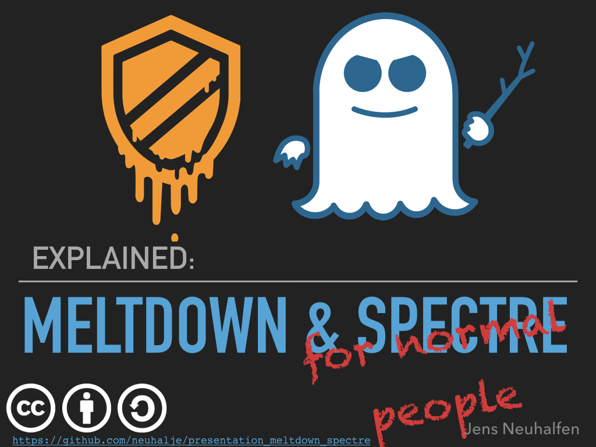

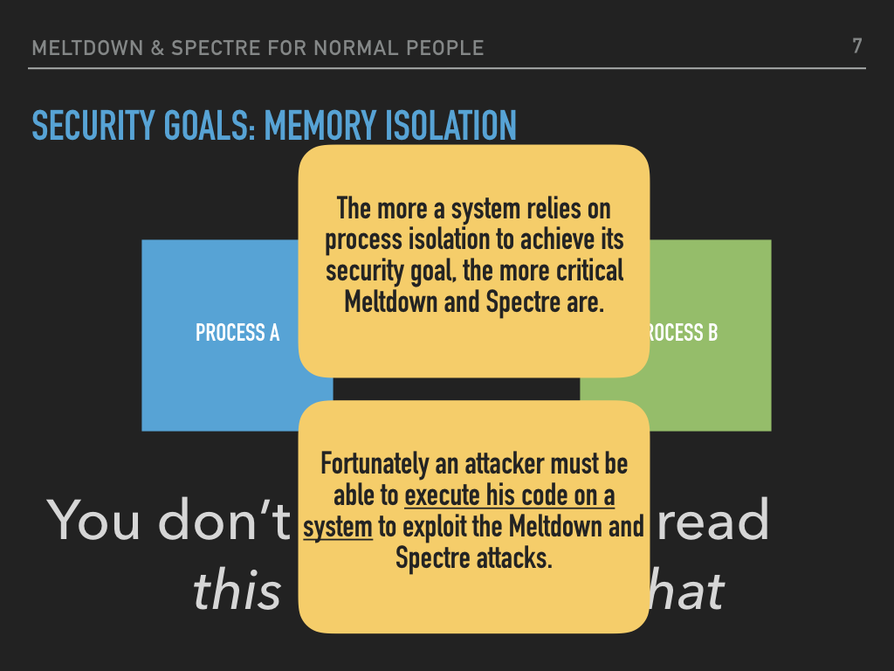

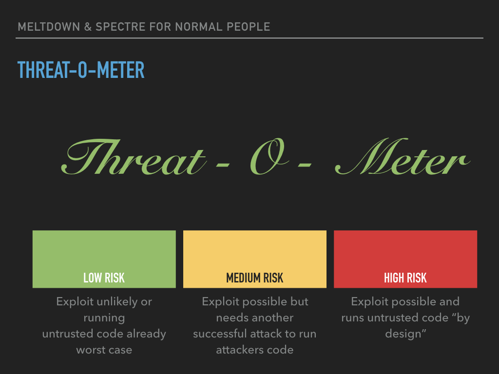

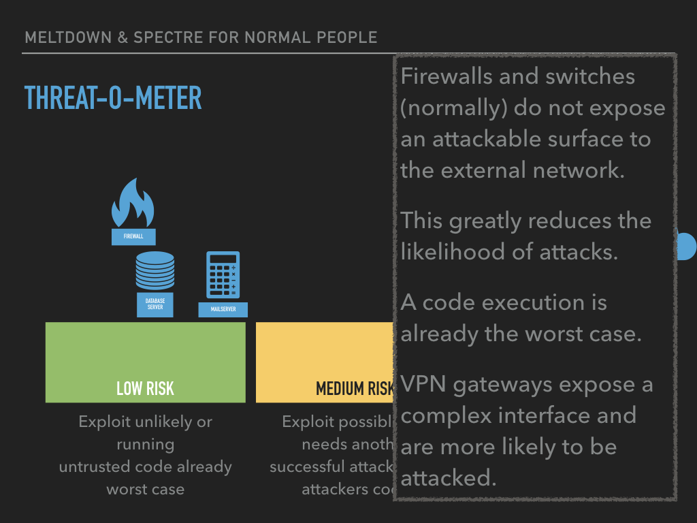

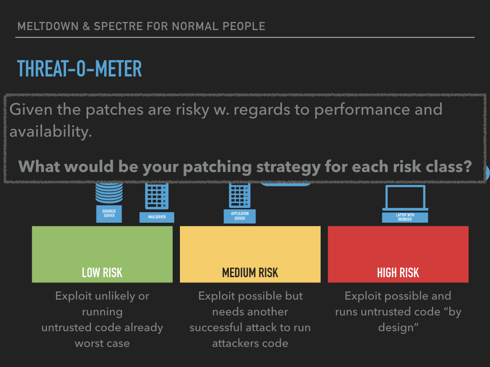

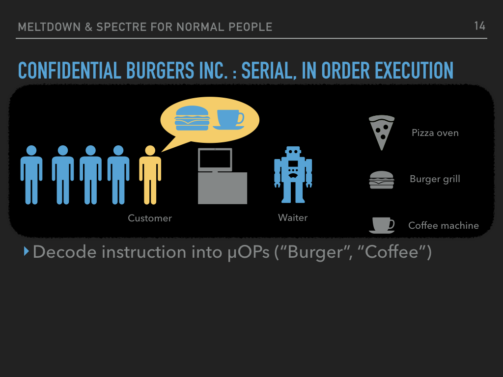

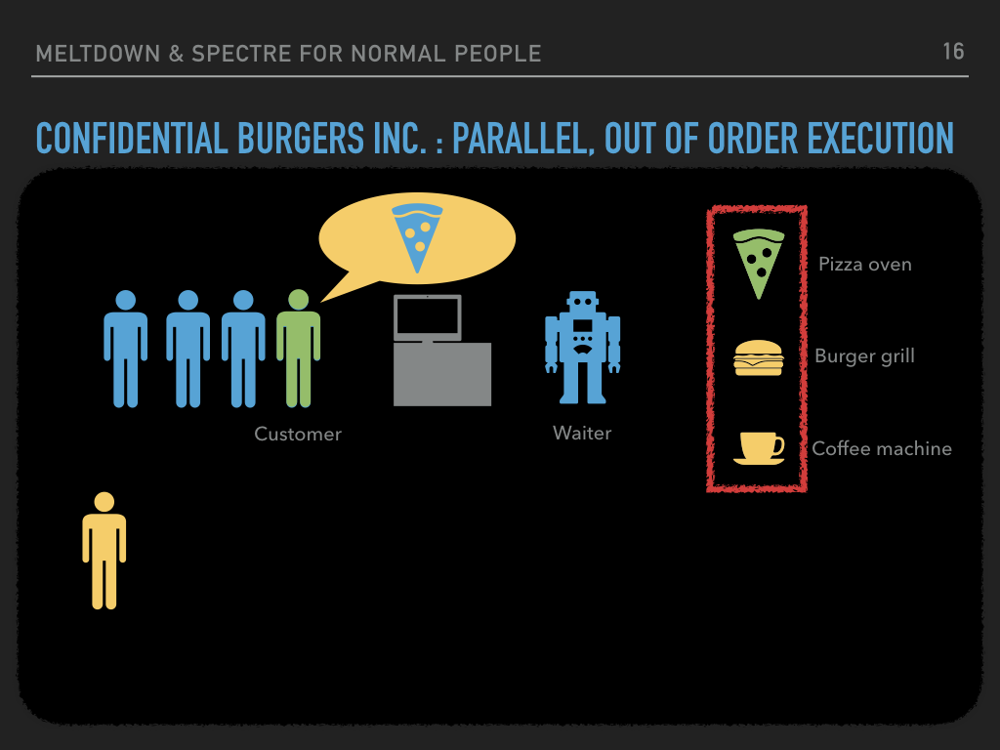

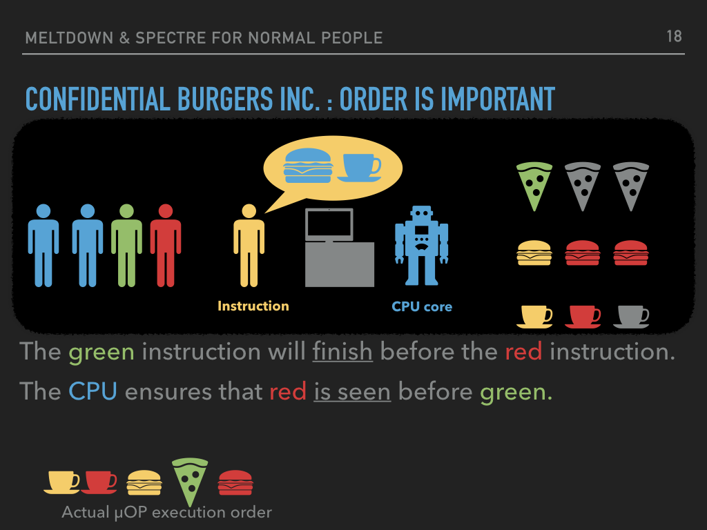

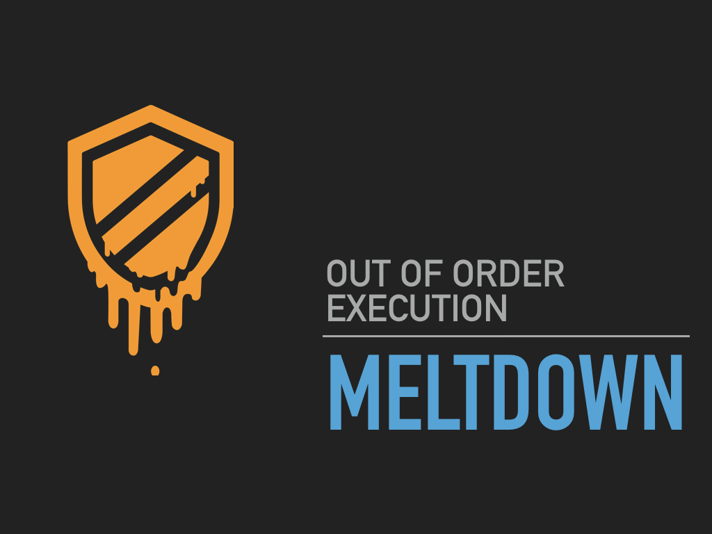

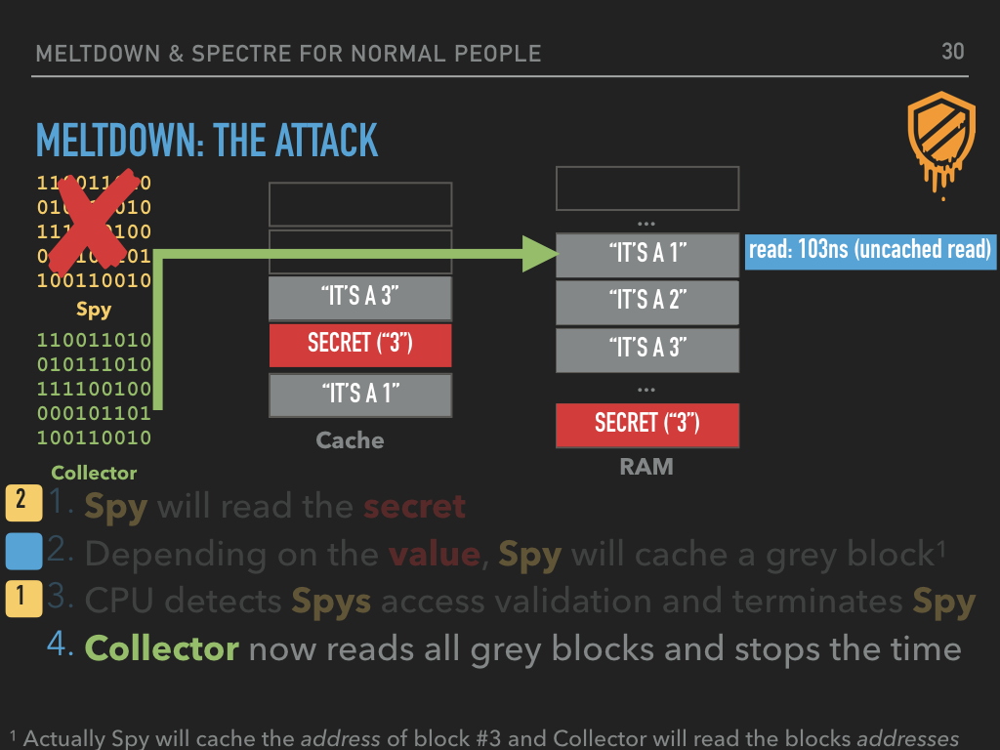

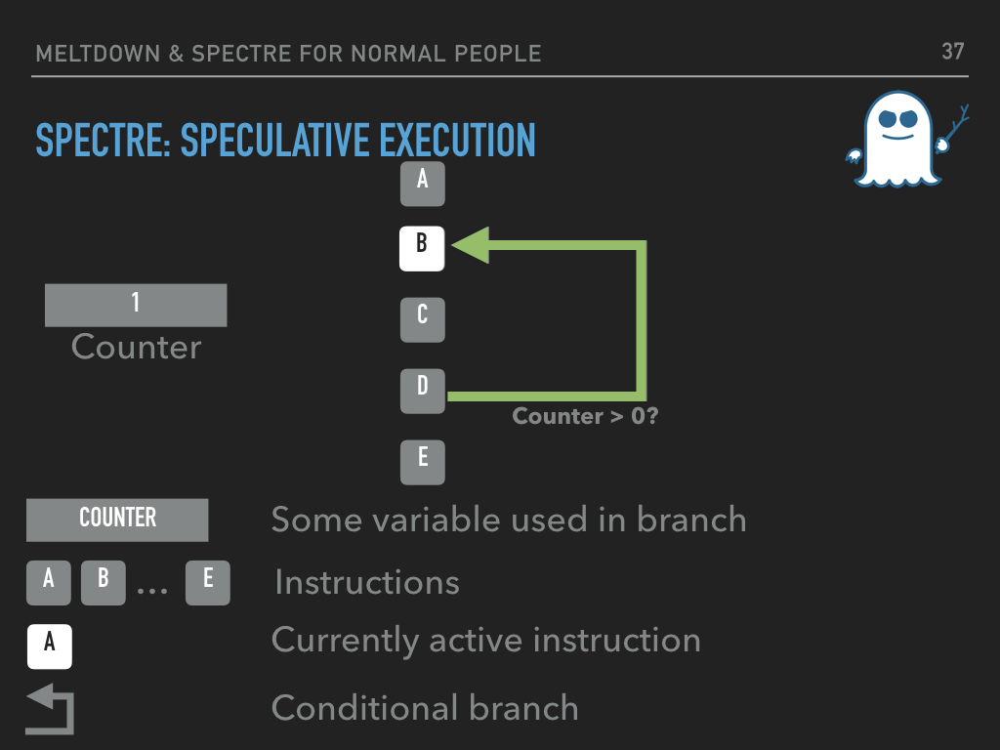

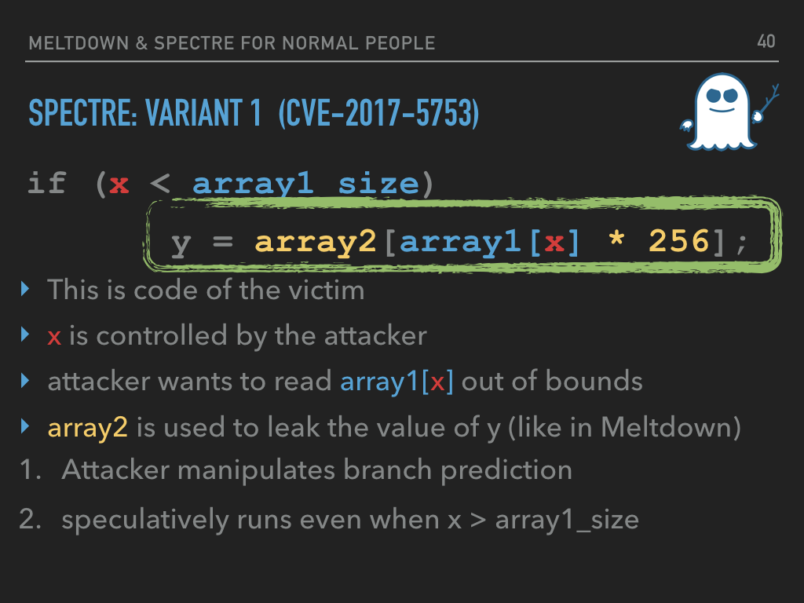

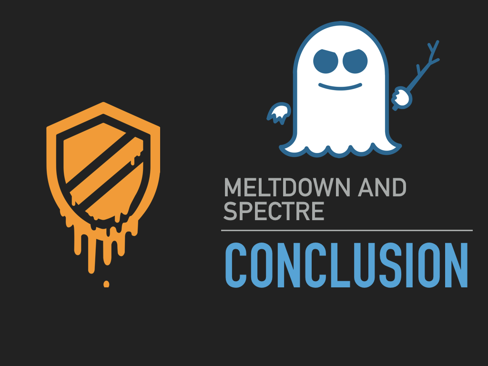

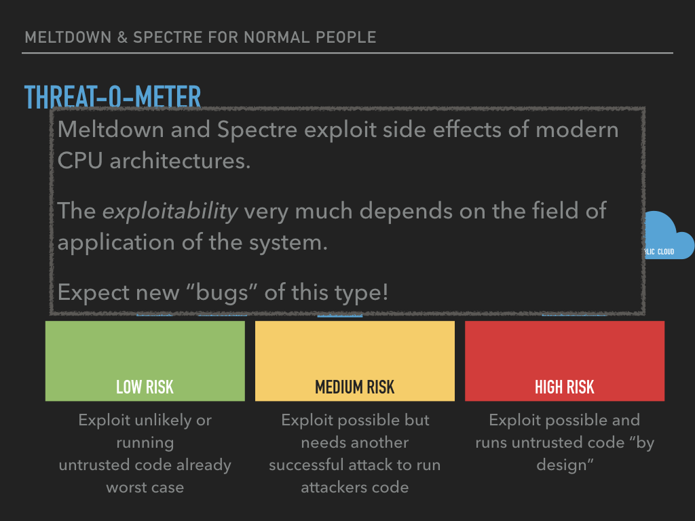
